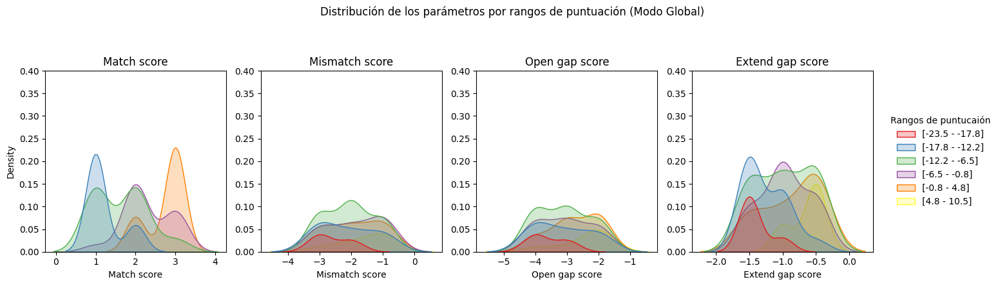

# Práctica 2: Alineamientos con Biopython

**Participantes:**
- Ricardo Juan Cárdenes Pérez
- Susana Suárez Mendoza

<div align="justify">
    
Esta práctica consta de dos ejercicios que ponen en práctica la función `PairWiseAligner` de Biopython para alinear secuencias y obtener la puntuación y el alineamiento óptimo.

## Ejercicio 1: 

Usa la clase PairWiseAligner de Biopython para alinear secuencias  de ADN y obtener la puntuación y el alineamiento óptimo en estos dos escenarios. Prueba a cambiar los parámetros del alineador como el esquema de puntuación, las penalizaciones de alineamiento y la modalidad de alineamiento (global o local). Compara los resultados obtenidos con diferentes configuraciones y explica las diferencias

### Apartado a) Obtener las secuencias aleatoriamente

#### 1. Generación de secuencias aleatorias de longitud fija o variable

Para generar las secuencias aleatorias, se ha implementado la función `generate_random_dna_sequence`, que utiliza la función `random.choice` del módulo estándar de Python. Esta función realiza un bucle que itera tantas veces como se indique en la longitud deseada de la secuencia y selecciona aleatoriamente un nucleótido de entre las opciones disponibles ('A', 'C', 'G', 'T').

El código de la función es el siguiente:

```python
def generate_random_dna_sequence(length):
    return ''.join(random.choice('ACGT') for _ in range(length))
```

Además, en el *notebook* presentado, la longitud de la cadena también se ha generado de manera aleatoria utilizando la función `random.randint`, lo que permite obtener secuencias de longitud variable en función de los parámetros especificados. Esto garantiza la variabilidad tanto en los nucleótidos como en la longitud de las secuencias generadas.

#### 2. Alineamiento de Secuencias Mediante Búsqueda en Rejilla

La **búsqueda en rejilla** es una técnica ampliamente utilizada para optimizar hiperparámetros en modelos de aprendizaje automático mediante la evaluación exhaustiva de todas las combinaciones posibles dentro de un espacio discretizado. Consiste en definir un conjunto de valores para cada hiperparámetro y construir una rejilla que abarque todas las combinaciones posibles. Cada configuración se emplea para entrenar o validar el modelo, evaluando su desempeño con una métrica específica, como la precisión o el error. En este contexto, se evalúan las puntuaciones obtenidas para identificar la variabilidad de los hiperparámetros y su impacto en el alineamiento.

Los parámetros probados para el alineamiento son los siguientes:

```python
param_grid = {
    "mode": ["global", "local"],
    "match_score": [1, 2, 3],
    "mismatch_score": [-1, -2, -3],
    "open_gap_score": [-2, -3, -4],
    "extend_gap_score": [-0.5, -1, -1.5],
}
```

El parámetro `open_gap_score` se asocia con la penalización aplicada a la apertura de un hueco en el alineamiento, mientras que `extend_gap_score` se refiere a la penalización por extender un hueco ya existente, independientemente de su posición. Para implementar la búsqueda en rejilla, se desarrolló una función que permite configurar los hiperparámetros del alineamiento y devuelve tanto la puntuación como el resultado del alineamiento:

```python
def align_with_parameters(seq1, seq2, **kwargs):
    aligner = PairwiseAligner()
    for key, value in kwargs.items():
        setattr(aligner, key, value)

    alignment = aligner.align(seq1, seq2)
    return alignment.score, alignment
```

Finalmente, las configuraciones de los parámetros, junto con las puntuaciones y los resultados del alineamiento, se almacenaron en un `DataFrame` para facilitar su análisis posterior. Esto permite comparar y seleccionar la combinación de parámetros más adecuada para el alineamiento óptimo de secuencias.

#### 3. Análisis de resultados

##### 3.1. Visualización de la puntuación en función del valor de los parámetros y el modo

Se propone generar gráficos de caja (*boxplots*) para analizar la relación entre cada hiperparámetro y la puntuación ("score") del alineamiento. La Figura 1 muestra el resultado para una secuencia aleatoria donde se observa que el modo local destaca en puntajes gracias a su enfoque en regiones similares y parámetros permisivos, mientras que el modo global es más sensible a penalizaciones debido a su alineamiento completo; entre los parámetros, *match_score* y *mismatch_score* tienen el mayor impacto directo en los puntajes finales. 

<div align="center">
    
      <p><strong>Figura 1.</strong> <i>Boxplots</i> .</p> 
</div>

##### 3.2. Visualización de cómo afectan las puntuaciones obtenidas bajo ciertas condiciones

Se propone agrupar las puntuaciones en un número de rango, generando etiquetas en formato `[min - max]` y asignando cada puntuación a uno de estos grupos (`score_group`). Luego, se visualiza cómo los parámetros ajustables (`match_score`, `mismatch_score`, `open_gap_score`, `extend_gap_score`) se distribuyen según los rangos de puntuación, creando subgráficos individuales con curvas de densidad. 

###### 3.2.1. Visualización de la distribución de parámetros por rangos de puntuación - Modo local

En el modo local, las configuraciones que generan puntuaciones más altas en el alineamiento de secuencias se asocian con valores altos de `match_score` y penalizaciones menos severas (valores menos negativos) en `mismatch_score`, `open_gap_score` y `extend_gap_score`. En particular, un `match_score` elevado recompensa mejor las coincidencias, mientras que penalizaciones ligeras para desajustes y brechas favorecen puntuaciones más altas, destacando la importancia de ajustar estas configuraciones para maximizar el rendimiento del alineamiento.

<div align="center">
    
      <p><strong>Figura 2.</strong>Curvas de densidad del modo local.</p> 
</div>

###### 3.2.2. Visualización de la distribución de parámetros por rangos de puntuación - Modo global

En el modo global, las puntuaciones más altas se logran con un `match_score` elevado, penalizaciones ligeras para desajustes (`mismatch_score` cercano a 0), y valores menos negativos en `open_gap_score` y `extend_gap_score`. Configuraciones que favorecen coincidencias y minimizan las penalizaciones por desajustes y brechas son clave para optimizar el alineamiento global, ya que estas reducen el impacto negativo de las restricciones en la puntuación final.

<div align="center">
    
      <p><strong>Figura 3.</strong>Curvas de densidad del modo global.</p> 
</div>

#### 4. Conclusiones Generales

Los resultados muestran que el desempeño de los alineamientos depende tanto de los parámetros configurados como del tipo de alineamiento (local o global). Los alineamientos locales, al enfocarse en regiones similares, ofrecen mejores puntajes con configuraciones más permisivas, siendo ideales para secuencias parcialmente conservadas. Por otro lado, los alineamientos globales, más sensibles a penalizaciones, requieren ajustes precisos para equilibrar recompensas como el `match_score` y penalizaciones (`mismatch_score`, `gap scores`) y son útiles para comparaciones a lo largo de toda la longitud de las secuencias. Ajustar los parámetros según el objetivo permite maximizar la utilidad en el análisis de similitudes y diferencias estructurales.

### Apartado b) Obtener las secuencias a partir de ficheros obtenidos de bases de datos biológicas

En este apartado se propone utilizar las herramientas de NCBI Entrez (una interfaz para buscar y recuperar información biológica). Para ello, se definen las siguientes funciones:
1. Función `get_sequences_ncbi`: esta función realiza una búsqueda en una base de datos de NCBI (como "nucleotide" o "protein") utilizando un término de búsqueda (`search_term`) y obtiene un número limitado de resultados (`max_results`). Posteriormente, llama a otra función para descargar las secuencias encontradas.
2. Función `get_sequences_by_id`: esta función descarga las secuencias de NCBI utilizando los identificadores de secuencia proporcionados. Las secuencias se guardan en archivos FASTA individuales en una carpeta local.

#### 1. Obtención del Fichero FASTA de las Secuencias

Se han planteado dos casos de estudio centrados en el análisis de secuencias genéticas: uno relacionado con las isoformas de un gen humano y otro enfocado en la comparación de un mismo gen entre dos especies diferentes.

**Caso 1: Gen BRCA1 (Breast Cancer 1).**  
El gen BRCA1 es un gen humano localizado en el cromosoma 17 (17q21) que codifica una proteína supresora de tumores, fundamental para el mantenimiento de la estabilidad del ADN y la regulación del ciclo celular. Su principal función es reparar el ADN dañado y prevenir mutaciones genéticas que podrían derivar en cáncer. En este caso, se propone analizar las diferencias entre las isoformas (variantes de transcripción) del gen BRCA1 en humanos.

**Caso 2: Gen FOXP2 (Forkhead Box P2).**  
El gen FOXP2 está asociado con el desarrollo del lenguaje y el habla en humanos, siendo crucial para la comunicación vocal en humanos y otros animales. En este caso, se propone comparar la secuencia del gen FOXP2 en humanos con la secuencia homóloga en ratones, con el objetivo de identificar similitudes y diferencias evolutivas entre ambas especies.

#### 2. Alineamiento de las secuencias de manera global

Para realizar el alineamiento global de las secuencias, se han desarrollado funciones específicas que permiten reconstruir y evaluar el alineamiento de manera detallada. Estas funciones se describen a continuación:
1. **`final_sequence`**  
   Esta función toma como entrada un objeto de alineamiento, junto con las secuencias objetivo (*target*) y consulta (*query*), y genera tres representaciones alineadas:
   - **Secuencia objetivo alineada**: refleja cómo la secuencia objetivo se ajusta en el alineamiento.
   - **Secuencia consulta alineada**: muestra la consulta alineada con la secuencia objetivo.
   - **Línea de alineamiento**: indica coincidencias (representadas por las bases alineadas), desajustes (`*`), y brechas (`-`) en las posiciones correspondientes.  
   Esto se logra recorriendo las coordenadas del alineamiento y manejando tanto los segmentos alineados como las brechas que puedan surgir.

2. **`count_alignment_details`**  
   Esta función analiza la línea de alineamiento generada por `final_sequence` y calcula:
   - **Coincidencias (`matches`)**: número de bases que coinciden entre las secuencias alineadas.
   - **Desajustes (`mismatches`)**: número de posiciones donde las bases no coinciden (`*`).
   - **Brechas (`gaps`)**: número de guiones (`-`) insertados en el alineamiento para manejar inserciones o deleciones.  
   Estos valores permiten evaluar la calidad del alineamiento y obtener métricas cuantitativas clave.

#### 3. Visualización de los resultados

##### **Caso 1.** Gen BRCA1.

La Figura 4 muestra las coincidencias (regiones en blanco), los huecos añadidos para el alineamiento (regiones en rojo) y los desajustes (regiones en azul) de las dos isoformas del gen. Aunque las isoformas tienen un grado significativo de similitud (como se ve en las regiones alineadas), las diferencias observadas en los desajustes y brechas indican variaciones significativas que podrían explorarse más para comprender su relevancia biológica. Esto es especialmente importante para el papel de BRCA1 como supresor de tumores y en el mantenimiento de la estabilidad del ADN.

<div align="center">
    
      <p><strong>Figura 4.</strong>Mapa de alineamiento de las isoformas del gen BRCA1.</p> 
</div>

##### **Caso 2.** Gen FOXP2.

La Figura 5 muestra información similar a la Figura 4 salvo que esta presenta el gen FOXP2. El análisis sugiere que el gen FOXP2 presenta una conservación significativa entre humanos y ratones, lo que resalta su importancia funcional. Sin embargo, las variaciones observadas (gaps y desajustes) apuntan a diferencias evolutivas que pueden estar relacionadas con las especializaciones funcionales en cada especie. 

<div align="center">
    
      <p><strong>Figura 5.</strong>Mapa de alineamiento del gen FOXP2.</p> 
</div>

</div>
